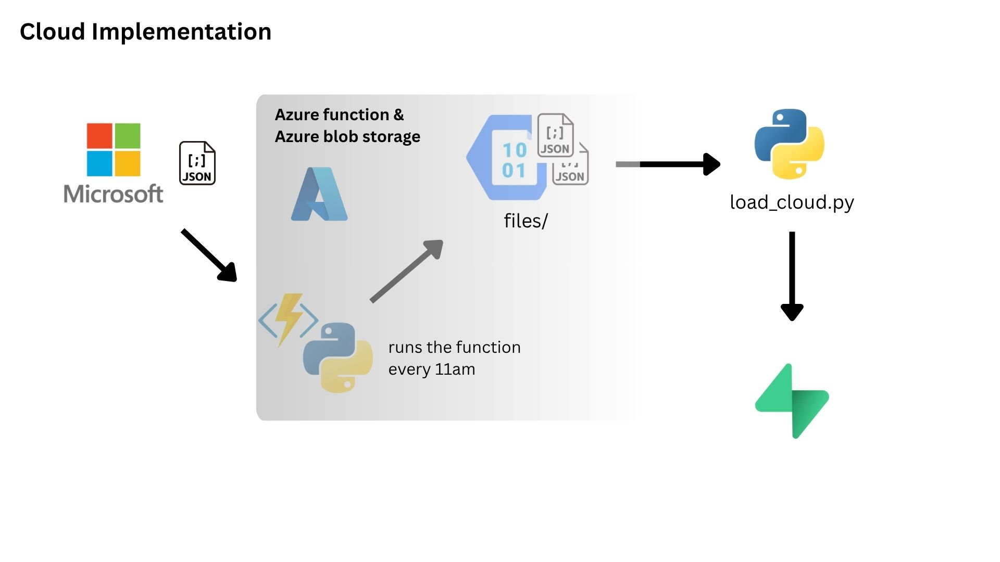
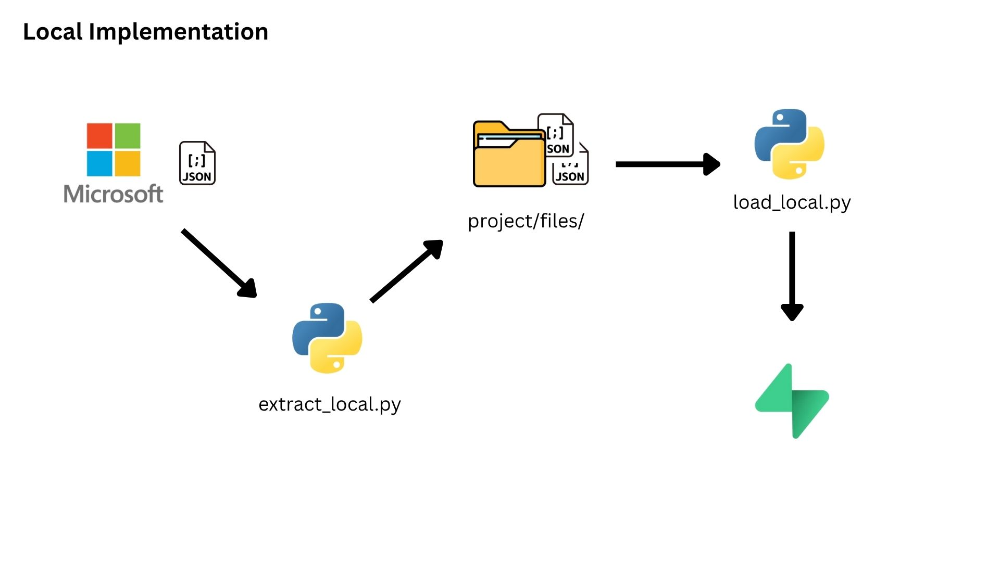

# 📋 MS Learn Data Catalog Pipeline
This data pipeline takes into consideration the Microsoft Learn Catalog. The main goal is to move the data from being a semi-structured JSON file to database tables.
- Link to databases:
    - 1 
    - 2

This pipeline was implemented locally and through cloud for flexibility.

## Keypoints
- Source: Microsoft Learn Catalog API (JSON).
- Cloud extraction scheduled daily at 9:00 AM PHT (UTC+08:00).
- Files saved to an Azure Blob container files/ as microsoft_learn_catalog_YYYYMMDD.json.
- Before loading, the pipeline checks for duplicates to avoid unnecessary operations/costs.
- Transformation: JSON → multiple pandas DataFrames (modules, units, subjects, …).
- Load: DataFrames inserted transactionally into the database (rollback on error).
- Note: A blob-triggered approach would be preferable; currently using a timer-trigger + load script.

## Contents
- Cloud Implementation
- Local Implementation
- Tradeoffs made

## ☁️ Cloud Implementation: Azure Function for Data Extraction

### How It Works

#### `function_app.py`

I have deployed an **Azure Function** configured with a **Timer Trigger**. It is scheduled to extract the JSON data for the **Microsoft Learn Catalog** every morning at **9:00 AM, Philippine Time**.

```python
@app.timer_trigger(
    arg_name="myTimer",
    schedule = "0 9 * * *",
    run_on_startup=False
)
@app.blob_output(
    arg_name="outputBlob",
    path="files/microsoft_learn_catalog_{datetime:yyyyMMdd}.json",
    connection="OutputStorageConnection"
def ExtractFunction(myTimer: func.TimerRequest, outputBlob: func.Out[str]) -> None:
    logging.info("Timer trigger starting data extraction.")
    ...
```

The primary task of this Azure Function is to **fetch the data** from the specified URL/API and then **load it into Azure Blob Storage**, specifically within a container named `files/`.

```python
        logging.info("Fetching Microsoft Learn catalog data...")
        response = requests.get(url, params=params, timeout=60)
        response.raise_for_status()
        data = response.json()

        # Serialize to JSON string
        json_string = json.dumps(data, indent=2)

        # Set the output: the Host handles the connection and file name creation
        outputBlob.set(json_string)

        logging.info(f"Upload completed to container 'files'!")
```
#### **`load_cloud.py`: Data Ingestion from Azure Storage**

This script handles the process of retrieving the extracted Microsoft Learn catalog JSON file from Azure Blob Storage and loading it into a relational database.

> **Caveat:** While this current approach is user-driven, a more automated and event-driven solution would be using an **Azure Blob Trigger**, a feature that is currently in development for this pipeline.

Assuming the user has the necessary keys and access to the Azure Storage account, the script `load_cloud.py` is executed from the `ms-learn-data-pipeline` directory by specifying the target file:

```bash
python load_cloud.py microsoft_learn_catalog_YYMMDD.json
```

**Step 1: Initial Checks and Database Connection**

The script first validates the input and establishes a connection to the database.

  * **Input Validation:** The script ensures that exactly one filename argument is provided.

    ```python
    # ms-learn-data-pipeline/load_cloud.py 
    # Get the file to load
    if len(sys.argv) != 2:
        print("Usage: python load.py <source_json_filename>")
        sys.exit(1)

    source_name = sys.argv[1]
    ```

  * **Database Connection:** It attempts to connect to the database using the stored connection string. A connection failure results in the script terminating.

    ```python
    # Connect to the database
    try:
        logger.info("Connecting to the database ...")
        conn_engine = create_engine(string_connection)
        
        logger.info("Connected to the database ...")
    except Exception as e: 
        print(f"Cannot establish connection :(\nError: {e}")
        sys.exit(1)
    ```

  * **Duplicate Check:** Before proceeding, the script checks the database to determine if the data from this specific source file (`source_name`) has already been loaded. This is a crucial, cost-saving step that prevents unnecessary calls to Azure Storage.

    ```python
    # Check for duplicates
    logger.info("Checking if file already exists ...")
    check_duplicates(conn_engine, source_name)
    ```

**Step 2: Connecting to Azure Storage and Downloading Data**

If the duplicate check passes, the script connects to Azure Blob Storage and retrieves the file.

```python
# ms-learn-data-pipeline/load_cloud.py 

logger.info(f"Connecting to Azure Storage ...")
    blob_service_client = BlobServiceClient.from_connection_string(
        azure_blob_str_connection,
        connection_timeout=CONNECTION_TIMEOUT_SECONDS
    )
    container_name = "files"
    blob_client = blob_service_client.get_blob_client(container=container_name, blob=source_name)
    downloaded_data = blob_client.download_blob().readall()
    data = json.loads(downloaded_data)
    logger.info(f"Data from Azure has been downloaded successfully...") 
```

The script performs the following actions:

1.  Initializes a `BlobServiceClient` using the connection string.
2.  Gets a client reference (`blob_client`) for the specific file (`source_name`) inside the `files` container.
3.  Downloads the data, reads the content as a string, and deserializes it into a Python dictionary (`data`) using `json.loads()`.

**Step 3: Data Transformation**

Once the JSON data is successfully read, the script transforms the relevant array structures within the JSON into distinct relational tables using the pandas library.

```python
# ms-learn-data-pipeline/load_cloud.py 

# Transform tables
logger.info("Tables are being transformed ...")
tables_dict = {}

# module table
df_modules = pd.DataFrame(data.get('modules'))
tables_dict['modules'] = transform(
    df_modules, source_name,
    'title', 'summary', 'locale', 'levels', 'roles',
    'products', 'subjects', 'url', 'last_modified', 'source_file', 
)

# units table
df_units = pd.DataFrame(data.get('units'))
tables_dict['units'] = transform(
    df_units, source_name,
    'title', 'locale', 'duration_in_minutes',
    'last_modified', 'source_file', 
)

...

df_subjects = pd.DataFrame(data.get('subjects'))
tables_dict['subjects'] = transform(df_subjects, source_name, 'name', 'children', 'source_file')
logger.info("Tables have been transformed and now ready to be loaded ...")
```

The data for each object type (e.g., `modules`, `units`, `subjects`) is converted into a pandas DataFrame, which is then passed to a custom `transform` function to clean, shape, and select the final columns before being stored in `tables_dict`.


**Step 4: Transactional Database Loading**

The final step loads all transformed tables into the database **transactionally**. This ensures **data integrity**: if an error occurs while loading any single table, the entire process is rolled back, and no data is committed to the database.

```python
# ms-learn-data-pipeline/load_cloud.py 

    with conn_engine.begin() as conn:  # automatically manages COMMIT/ROLLBACK
        logger.info("Loading tables into the database transactionally ...")

        for table_name, df in tables_dict.items():
            load(df, table_name, conn)  

        logger.info("All tables loaded successfully.")
    logger.info("Transaction committed successfully. Load complete!")
```

The `conn_engine.begin()` context manager automatically handles the SQL `COMMIT` upon success or a `ROLLBACK` upon failure, completing the robust data pipeline.

## 📂 Local Implementation

### How it works
---
#### `extract_local.py`
The pipeline uses `extract_local.py` to extract the JSON Microsoft Learn catalog from the given url, see the snippets of the code:
```python
# ms-learn-data-pipeline/extract_local.py
response = requests.get(url, params=params, timeout=60)
response.raise_for_status()

# make this cloud based
with open(fn, "w", encoding="utf-8") as f:
    json.dump(response.json(), f, ensure_ascii=False)
    print("saved:", fn)
```
This simply saved the extracted JSON to the local folder (`/files`) at the same level of `extract_local.py`
#### `load_local.py`
Once the JSON file of the days's catalog was extracted and stored to `ms-learn-data-pipeline/files/`, the user can run `load_local.py` on the terminal with only one argument and that is the name of the file they want to load to the database. See the snippet:
```python
# Connect to the database
try:
    logger.info("Connecting to the database ...")
    conn_engine = create_engine(string_connection)
    
    logger.info("Connected to the database ...")
except Exception as e: 
    print(f"Cannot establish connection :(\nError: {e}")
    sys.exit(1)
```
This is the part of establishing connection to the database, and we want to do that because we want to check first if the file that you want to load has already loaded to the database.
```python
# Check if the file exists inside the local folder
try:
    print(os.listdir("files"))
    with open(f"files/{source_name}", 'r', encoding="utf-8") as f:
        data = json.load(f)
except FileNotFoundError as e:
    logger.error(f"{e}: File does not exist ...")
    sys.exit(1)

# Check for duplicates
logger.info("Checking if file already exists ...")
check_duplicates(conn_engine, source_name)
```
This checks the possibility of the loading. We want to do this first to prevent doing tasks that would not be needed.

Once the checks were accomplished, the program then proceeds to the transformation of the JSON file
```python
# Transform tables
logger.info("Tables are being transformed ...")
tables_dict = {}

# module table
df_modules = pd.DataFrame(data.get('modules'))
tables_dict['modules'] = transform(
    df_modules, source_name,
    'title', 'summary', 'locale', 'levels', 'roles',
    'products', 'subjects', 'url', 'last_modified', 'source_file', 
)

# units table
df_units = pd.DataFrame(data.get('units'))
tables_dict['units'] = transform(
    df_units, source_name,
    'title', 'locale', 'duration_in_minutes',
    'last_modified', 'source_file', 
)

...

df_subjects = pd.DataFrame(data.get('subjects'))
tables_dict['subjects'] = transform(df_subjects, source_name, 'name', 'children', 'source_file')
logger.info("Tables have been transformed and now ready to be loaded ...") 
```

Once the JSON is formatted into different structured table it is now the time to load it to the database
```python
try:
    with conn_engine.begin() as conn:  # automatically manages COMMIT/ROLLBACK
        logger.info("Loading tables into the database transactionally ...")

        for table_name, df in tables_dict.items():
            load(df, table_name, conn)  

        logger.info("All tables loaded successfully.")
    logger.info("Transaction committed successfully. Load complete!")

except Exception as e:
    logger.error(f"Load failed, transaction rolled back automatically.\nError: {e}")
    sys.exit(1)
```
The program loads the dataframe transactionally which means nothing will be loaded if halfway through loading an error occured.

## Trade-offs
The main problems I saw in here are:
1. **First the lack of documentation in the given case study**
- In the given notion problem it was not stated if the JSON changes every day nor any modification that can happen and therefore further research had to be done to make sure that the project won't crash
- For instance, in the documentation of the API https://learn.microsoft.com/en-us/training/support/catalog-api-developer-reference it was stated there that the "tables" or "categories" will be consistent, that knowledge aided with how I wrote the code.
2. **Another main problem is the need for automation**
- It is obvious in the given case study that we want to extract data and load it daily, running the scripts again and again and storing it locally will be painful not just with the time but also the storage
- Thus I had to innovate a way to solve this and opted for cloud solution wherein the scripts are scheduled to run everyday.
3. **Transferring from simple SQLite to PostgreSQL**
- It is evident that the main goal for this is to supply data that can be used for analytics therefore I must not opt for a simple SQLite becuase it is not secure and being just a file, any changes made to it won't be visble to others (say data engineers, analysts, scientist)
- So we transferred to cloudbased postgreSQL which is supabase
- In this database server, the admin can set authorization to all. Any changes will be visible to entire team as well for this is now a cloud-based solution.